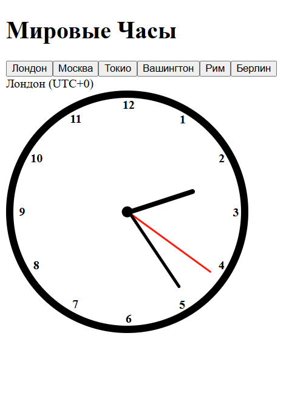
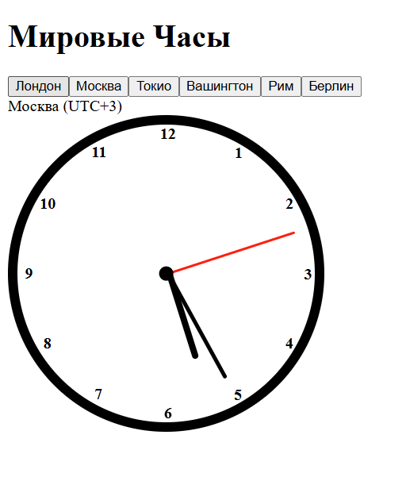
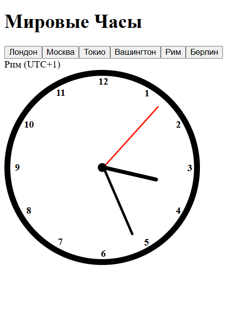
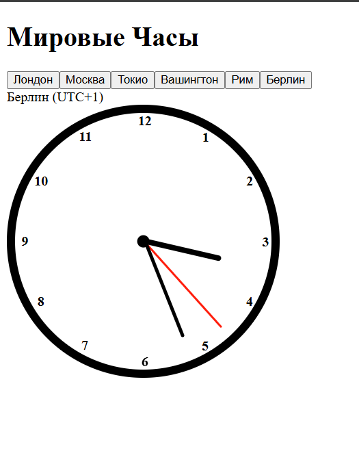
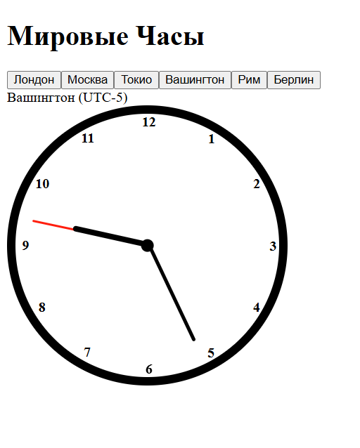

Работу выполнил Рахманинов Савва 
ЭФБО-06-24
21 вариант

Моё веб-приложение показывает время в разных часовых поясах (по столицам некоторых стран) в аналоговом формате. На скринах показана работоспособность
 - Лондон
 - Москва
 - Рим
 - Берлин
 - Токио
 - Вашингтон
